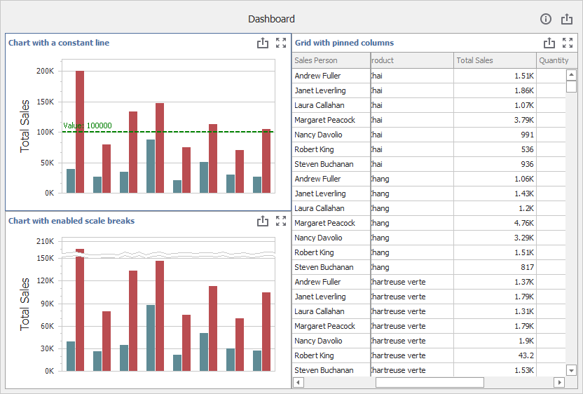

<!-- default badges list -->

<!-- default badges end -->

# Dashboard for WinForms - Custom Properties

The following example shows how to create [custom properties](http://docs.devexpress.com/Dashboard/401595/designer-and-viewer-applications/winforms-designer/custom-properties) for the WinForms Dashboard. 

## Files to Look At

* [Form1.cs](./CS/WinForms-Dashboard-Custom-Properties/Form1.cs) (VB: [Form1.vb](./VB/WinForms-Dashboard-Custom-Properties/Form1.vb))
* [Modules](./CS/WinForms-Dashboard-Custom-Properties/Modules/) (VB: [Modules](./VB/WinForms-Dashboard-Custom-Properties/Modules/))

The example contains the following custom properties organized into separate modules: 

## Dashboard Description

[DashboardDescriptionModule.cs](./CS/WinForms-Dashboard-Custom-Properties/Modules/DashboardDescriptionModule.cs) (VB: [DashboardDescriptionModule.vb](./VB/WinForms-Dashboard-Custom-Properties/Modules/DashboardDescriptionModule.vb))

This module enables you to set a dashboard description. The **Dashboard Description** button is in the _Dashboard_ Ribbon's group on the _Home_ page. The dashboard description is displayed when you hover over the info button in the dashboard title. 
    
**Overview:**
* Adds a custom string property for a dashboard.
* Provides editors to edit a dashboard description.
* Shows how to add a new item to an existing Ribbon group.

## Grid Fixed (Pinned) Columns

[GridFixedColumnModule.cs](./CS/WinForms-Dashboard-Custom-Properties/Modules/GridFixedColumnModule.cs) (VB: [GridFixedColumnModule.vb](./VB/WinForms-Dashboard-Custom-Properties/Modules/GridFixedColumnModule.vb))

This module enables you to pin columns in the Grid item. The **Fix Columns** button is in the _Custom Properties_ Ribbon's group on the Grid's _Design_ page. The button invokes an editor where you can set which columns to pin.

**Overview:**
* Adds a custom Boolean property for a specific data item container (Grid columns).
* Provides an editor that displays a list of grid columns to be pinned.
* Shows how to create a new group in the Ribbon and add a new item.

## Chart Scale Break

[ChartScaleBreakModule.cs](./CS/WinForms-Dashboard-Custom-Properties/Modules/ChartScaleBreakModule.cs) (VB: [ChartScaleBreakModule.vb](./VB/WinForms-Dashboard-Custom-Properties/Modules/ChartScaleBreakModule.vb))

This module enables or disables scale breaks for the Chart dashboard item. The **Scale Break** button is in the _Custom Properties_ Ribbon's group on the Chart's _Design_ page.

**Overview:**
* Adds a boolean custom property for a specific dashboard item (Chart).
* Shows how to create a new group in the Ribbon and add a new item.
* Customizes export to display the result in the exported document.

## Chart Constant Line

[ConstantLineUserValueModule.cs](./CS/WinForms-Dashboard-Custom-Properties/Modules/ConstantLineUserValueModule.cs) (VB: [ConstantLineUserValueModule.vb](./VB/WinForms-Dashboard-Custom-Properties/Modules/ConstantLineUserValueModule.vb))

This module allows you to draw a constant line for the selected Chart item. The **Constant Line** button is in the _Custom Properties_ ribbon group on the Chart's _Design_ page. The button invokes an editor that allows you to set constant line's options.

**Overview:**
* Adds a complex custom property for a specific dashboard item (Chart).
* Shows how to create a new group in the Ribbon and add a new item.
* Customizes export to display the result in the exported document.

## Documentation

- [WinForms Designer - Custom Properties](https://docs.devexpress.com/Dashboard/401595/)

## More Examples
- [ASP.NET MVC Dashboard Control - Custom Properties](https://github.com/DevExpress-Examples/asp-net-mvc-dashboard-custom-properties-sample)
- [ASP.NET Web Forms Dashboard Control - Custom Properties](https://github.com/DevExpress-Examples/asp-net-web-forms-dashboard-custom-properties-sample)
- [ASP.NET Core Dashboard Control - Custom Properties](https://github.com/DevExpress-Examples/asp-net-core-dashboard-custom-properties-sample)
- [Dashboard Component for Angular - Custom Properties](https://github.com/DevExpress-Examples/angular-with-asp-net-core-dashboard-custom-properties-sample)
- [WPF Dashboard Viewer - Custom Properties](https://github.com/DevExpress-Examples/wpf-dashboard-custom-properties)
- [Multiplatform Example - Constant Lines](https://github.com/DevExpress-Examples/dashboard-constant-lines)
